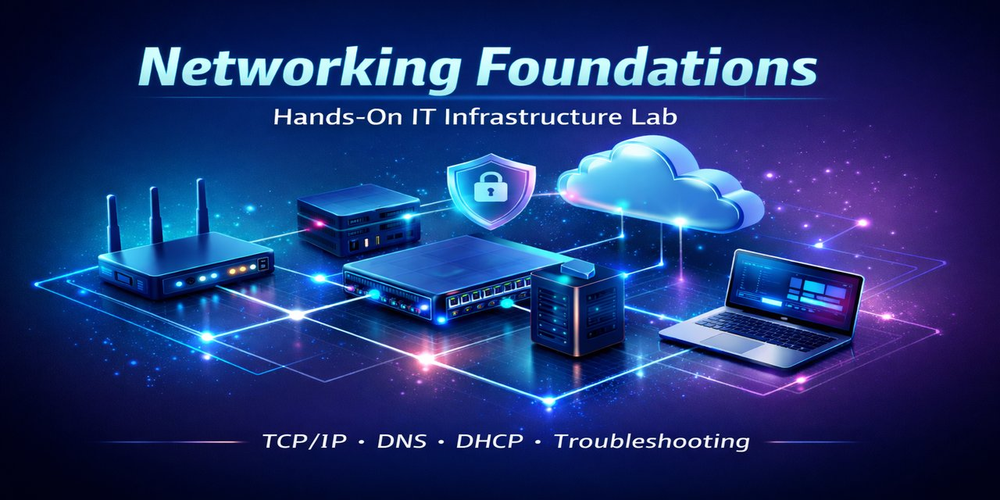

(project in progress)

## Operational Relevance (Network Infrastructure and Connectivity)

This project demonstrates foundational network administration supporting endpoint connectivity and identity services in a simulated small-office environment. An IP addressing plan is included for a single IPv4 subnet along with a lightweight asset register documenting core devices. DHCP and basic DNS services are configured to provide consistent address assignment and name resolution for networked endpoints, supporting reliable service discovery and domain authentication. 

## Job Duties Demonstrated

- Configure and support network infrastructure to provide reliable endpoint connectivity  
- Document IPv4 addressing using a defined subnet, DHCP scope, and gateway configuration  
- Configure and validate DHCP and basic DNS services  
- Maintain an asset register to track devices, roles, hostnames, and network context  

## Scope of Work

### Switch Setup & Baseline Connectivity
Endpoint documentation, subnet consistency, Layer 2/3 connectivity testing

Implementation Details

- Connected a **TP-Link 8-port Gigabit desktop switch** to the router and lab endpoints:

  - **Port 1** (uplink): Router  
  - **Port 2:** OptiPlex desktop  
  - **Port 3:** ThinkPad laptop  

- Observed green link/activity LEDs on all three ports, indicating active **1 Gbps Ethernet connections**.

- Ran `ipconfig /all` on both endpoints to document host identity, IP addressing, and DHCP lease details.

**Desktop**
- Hostname: `Rob-Desktop`
- IPv4 Address: `192.168.0.158/24`
- Default Gateway: `192.168.0.1`
- DHCP Server: `192.168.0.1`
- MAC Address: `54-BF-64-7B-CE-20`

**Laptop**
- Hostname: `Rob-Laptop`
- IPv4 Address: `192.168.0.63/24`
- Default Gateway: `192.168.0.1`
- DHCP Server: `192.168.0.1`
- MAC Address: `8C-16-45-3E-DA-64`

- Confirmed both endpoints were assigned addresses within the same subnet (`192.168.0.0/24`), validating correct DHCP scope configuration.

**Connectivity Testing**
- Enabled Windows Defender Firewall rules for ICMP echo requests
- Performed bidirectional `ping` tests between endpoints
- Verified successful ICMP responses with no packet loss

**Outcome:**  
- Established baseline Layer 2 and Layer 3 connectivity, validated DHCP functionality, and documented core lab endpoints.  
- Baseline connectivity validation supports downstream services including domain authentication, DHCP reservations, and server role deployment.

### DHCP Addressing Plan & Basic DNS
Router hardening, IP addressing strategy, DHCP scope/reservations, DNS configuration/validation

Implementation Details

**Router Hardening & DHCP Scope**
- Updated router default credentials and applied latest firmware (network infrastructure hardening)
- Configured DHCP address pool:  
  `192.168.0.100–192.168.0.199`
- Reserved static address block outside DHCP scope:  
  `192.168.0.200–192.168.0.254` (future appliances and ad-hoc lab testing)

**DHCP Reservations**
Configured DHCP reservations within the active scope for key lab endpoints:

- **Desktop:**  
  MAC `54-BF-64-7B-CE-20` → `192.168.0.198`
- **Laptop:**  
  MAC `8C-16-45-3E-DA-64` → `192.168.0.101`

Released and renewed DHCP leases on both hosts and confirmed that each endpoint obtained its reserved IP address.

**DNS Configuration & Validation**
- Configured upstream DNS resolvers to **Cloudflare** (`1.1.1.1` / `1.0.0.1`) for performance and privacy
- Client systems use the router (`192.168.0.1`) as their DNS server, which forwards queries upstream
- Verified external name resolution using:  
  `nslookup www.google.com 1.1.1.1`

**Outcome:**  
- Endpoints have predictable, reserved IP addressing with verified DNS resolution.
- Addressing plan supports stable identity services, server roles, and future lab growth.

### Asset Register (Lightweight) & IP Addressing Scheme

Asset Register

| Device  | Model                  | Hostname     | CPU                | RAM        | Storage            | Network                               | Notes                          |
|--------|------------------------|--------------|--------------------|------------|--------------------|----------------------------------------|--------------------------------|
| Desktop | Dell Optiplex 5060 SFF | rob-desktop  | Intel Core i5-8500 | 32 GB DDR4 | 1 TB M.2 NVMe SSD  | TP-Link WiFi 6E Intel AX210 PCIe       | Primary lab workstation             |
| Laptop  | Lenovo ThinkPad T480  | rob-laptop   | Intel Core i7-8550U | 16 GB DDR4 | 256 GB Samsung MZ7LN | Intel Dual Band AC 8265               | Portable lab endpoint          |
| Switch  | TP-Link TL-SG108      | –            | –                  | –          | –                  | 8 Gigabit Ethernet ports              | Layer 2 access switch (unmanaged) |
| Router  | TP-Link Archer AX1800 | –            | –                  | –          | –                  | Gigabit WAN, WiFi 6                   | NAT, stateful firewall, DHCP server, DNS forwarder |

  
IP Addressing Scheme

### IP Addressing Scheme

| Device / Role     | Hostname        | IP Address          | MAC Address           | Subnet Mask       | Gateway       | Operating System | Notes                                      |
|-------------------|-----------------|---------------------|-----------------------|-------------------|---------------|------------------|--------------------------------------------|
| Network Address   | –               | 192.168.0.0         | –                     | 255.255.255.0     | –             | –                | Defines subnet boundary                    |
| Desktop           | rob-desktop     | 192.168.0.158       | 54-BF-64-7B-CE-20     | 255.255.255.0     | 192.168.0.1   | Windows 11 Pro   | DHCP reservation                           |
| Laptop            | rob-laptop      | 192.168.0.63        | 8C-16-45-3E-DA-64     | 255.255.255.0     | 192.168.0.1   | Windows 11 Home  | DHCP reservation                           |
| Router            | edge-gateway    | 192.168.0.1         | 74-FE-CE-37-46-01     | 255.255.255.0     | 192.168.0.1   | TP-Link Firmware | Default gateway, DHCP/DNS server           |
| Switch            | –               | –                   | –                     | 255.255.255.0     | 192.168.0.1   | Unmanaged        | Unmanaged Layer-2 switch (no management IP) |
| DHCP Scope        | –               | 192.168.0.100–199   | –                     | 255.255.255.0     | 192.168.0.1   | –                | Reserved for dynamic clients               |
| Broadcast         | –               | 192.168.0.255       | –                     | 255.255.255.0     | –             | –                | Sends to all hosts on subnet               |

## Future Enhancements

- Introduce a virtualized lab server to demonstrate server hosting concepts and support additional infrastructure services  
- Implement a VPN solution to enable secure remote access and simulate off-site connectivity scenarios  
- Add network monitoring and health checks to increase visibility into device availability and performance (PowerShell)  
